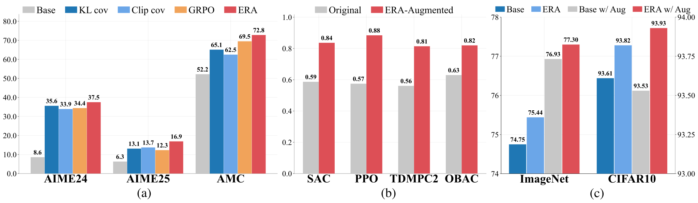
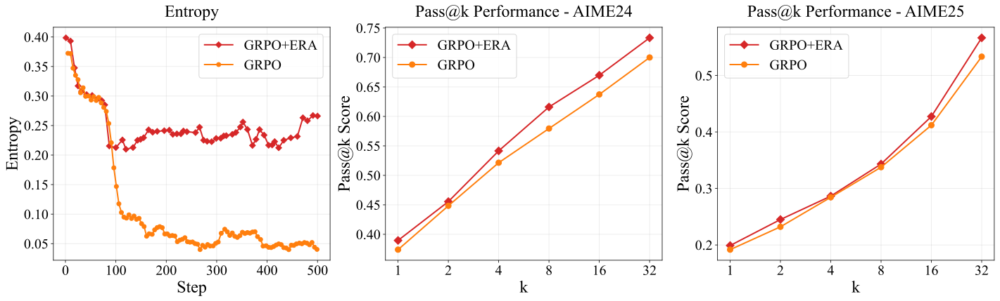
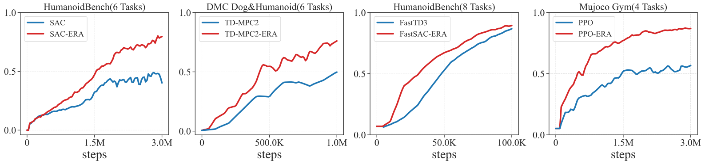
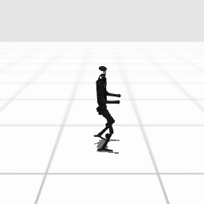
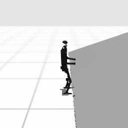
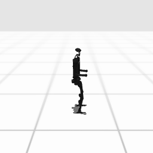
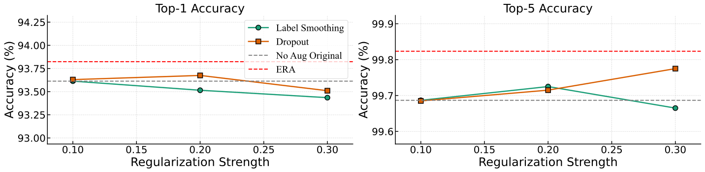

<div align="center">

# Entropy Regularizing Activation: Boosting Continuous Control, Large Language Models, and Image Classification with Activation as Entropy Constraints

[](https://arxiv.org/abs/2306.14838)  [](https://github.com/nothingbutbut/era) [](https://nothingbutbut.github.io/era/) [](https://x.com/nothingbutbut)

<div align="center" style="font-family: Arial, sans-serif;">
  <p>
    <a href="#🎉news" style="text-decoration: none; font-weight: bold;">🎉 News</a> •
    <a href="#📖introduction" style="text-decoration: none; font-weight: bold;">📖 Introduction</a>
  </p>
  <p>
    <a href="#🎈citation" style="text-decoration: none; font-weight: bold;">🎈 Citation</a> •
    <a href="#🌻acknowledgement" style="text-decoration: none; font-weight: bold;">🌻 Acknowledgement</a> •
    <a href="#📬Contact" style="text-decoration: none; font-weight: bold;">📬 Contact</a>
  </p>
</div>

</div>

# 🎉News
- **[2025/10/08]** Released our Paper on arXiv. See [here](https://arxiv.org/pdf/2505.22617). We propose ERA, a new paradigm that constrains the sampling entropy above given thresholds by applying specially designed activations to the outputs of models.

# 📖Introduction
<div align="left">
<div align="left">
  
</div>

We propose ERA, a new paradigm that constrains the sampling entropy above given thresholds by applying specially designed activations to the outputs of models. Our approach demonstrates broad effectiveness across different domains: **1) for large language models (LLMs)**, boosting the AIME 2025 score for Qwen2.5-Math-7B by **37.4%**; **2) for continuous control reinforcement learning agents**, improving performance by more than **30%** over strong baselines such as SAC on the challenging HumanoidBench; **3) for image classification**, enhancing ImageNet top-1 accuracy by **0.69%** for ResNet-50. These gains are achieved with a computational overhead of less than **7%**. Our work validates output activation as a powerful tool for entropy control, opening a new direction for designing simpler and more robust algorithms.


## 🚀 Large Language Models



**Entropy comparison and pass@k results for GRPO with ERA (ours) versus GRPO.** The entropy curves demonstrate that ERA mitigates entropy collapse and establishes a clear lower bound. The pass@k results further indicate that ERA enhances exploration and strengthens the model’s reasoning ability.

For large language models, we apply an activation layer to the logits $z$ to obtain a transformed set $z'$. This layer adaptively modulates the logit values based on the response entropy $H_{\text{resp}}$ and token advantage $A_t$:

$$
z' = \begin{cases}
k z & H_{\text{resp}} < \omega_{\text{low}},\; A_{t}>0 \\
z & \omega_{\text{low}} \leq H_{\text{resp}} \leq \omega_{\text{high}} \\
\tfrac{1}{k} z & H_{\text{resp}} > \omega_{\text{high}},\; A_{t}>0
\end{cases}
$$

To ensure the stability of the policy update, we apply an inverse scaling factor to the advantages of the modified tokens:

$$
A'_t = \begin{cases}
\frac 1k A_t & H_{\text{resp}} < \omega_{\text{low}},\; A_{t}>0 \\
A_t & \omega_{\text{low}} \leq H_{\text{resp}} \leq \omega_{\text{high}} \\
k A_t & H_{\text{resp}} > \omega_{\text{high}},\; A_{t}>0
\end{cases}
$$

This allows ERA to be integrated seamlessly into on-policy algorithms, resulting in the following GRPO objective:

$$
J(\theta) = \mathbb{E}_t \left[\mathbb{E}_{a_t\sim \pi_\theta(\cdot \mid s_t)} \log \pi_\theta'(a_t\mid s_t)\, A'_t \right]
$$

---

## 🦾 Continuous Control



**Main Results of ERA in Continuous Control.** Aggregate normalized performance on HumanoidBench (6 tasks, with SAC), DMC (Humanoid & Dog) (6 tasks, with TD-MPC2), HumanoidBench (8 tasks, with FastSAC) and Mujoco Gym (4 tasks, with PPO). ERA consistently accelerates learning and achieves superior asymptotic performance.

In continuous control, we enforce a minimum entropy on the final policy by constraining the underlying Gaussian's entropy to a higher value. This is achieved by adjusting the Gaussian's standard deviation, $\sigma$. Our activation function $g(\cdot)$ computes the final parameters $(\mu', \sigma')$ as:

$$
\mu' = \mu,\quad
\sigma' = \exp\left[\max \left(\log \sigma_{\max} + \frac{\left(\mathcal{H}_0' - D\log \sqrt{2\pi e} - D \log \sigma_{\max}\right) e^{\hat{\sigma}_i}}{\sum_{j=1}^{D} e^{\hat{\sigma}_j}}, \log \sigma_{\min}\right)\right]
$$

Here, $\mathcal{H}_0'$ is the target entropy plus a compensation parameter $\delta \ge 0$ to account for the bounding bias. This parameter can be a constant or automatically tuned by minimizing the following loss:

$$
L(\hat{\delta}) = \mathbb{E}_{s \sim \mathcal{D}} \left[\hat{\delta}\left(\mathcal{H}[\pi(\cdot\mid s)] - \mathcal{H}_0\right)\right]
$$

### Policy Visualization

<div align="center">
  <table>
    <tr>
      <td align="center">Dog Run<br></td>
      <td align="center">Dog Walk<br></td>
      <td align="center">Humanoid Run<br></td>
      <td align="center">Humanoid Walk<br></td>
    </tr>
    <tr>
      <td align="center">H1 Run<br></td>
      <td align="center">H1 Walk<br></td>
      <td align="center">H1 Slide<br></td>
      <td align="center">H1 Stand<br></td>
    </tr>
  </table>
</div>

---

## 🖼️ Image Classification

In discrete classification, regularizing predictive entropy is crucial for preventing overconfidence. For a softmax policy, we transform the pre-activation logits $z$ into $z'$ to ensure the policy's entropy is at least a target value $\mathcal{H}_0$:

$$
z' = h^{-1}\left[\max \left(\frac{\log \tau}{\tau} + \left(C_{\mathcal{H}_0} - n \frac{\log \tau}{\tau}\right)\frac{1}{D-1}\left(1 - \frac{e^{z_i}}{\sum_{j=1}^{D} e^{z_j}}\right),\, 0\right)\right]
$$

Unlike label smoothing which applies uniform regularization, ERA allows the model to learn a structured, input-dependent uncertainty distribution, tailoring the regularization to each sample for greater expressive capacity and improved performance.

### Performance on ImageNet and CIFAR-10


**Top-1 and Top-5 accuracy (%) on ImageNet and CIFAR-10.** We compare ERA against the original ResNet-50 baseline. Δ denotes the absolute improvement of ERA. All models are trained for 200 epochs.

### Comparison with Other Regularization Methods

To investigate the effectiveness of ERA against common regularization methods, we conducted comparative experiments on CIFAR-10 against various intensities of Label Smoothing and Dropout. The results below show that increasing label smoothing intensity can harm performance, and dropout offers marginal gains. In contrast, ERA consistently and effectively enhances model performance, validating its advantage over conventional regularization methods.



# 🎈Citation
If you find this work useful in your research, please consider citing:

```bibtex
@article{lee2023entropy,
    title={Entropy Regularizing Activation: Boosting Continuous Control, Large Language Models, and Image Classification with Activation as Entropy Constraints},
    author={Zilin Kang, Chonghua Liao, Tingqiang Xu, Huazhe Xu},
    journal={arXiv preprint arXiv:2306.14838},
    year={2025}
}
```

# 🌻 Acknowledgement
Our code is built upon the following open-source projects. We sincerely thank the authors for their contributions to the community.
- [Qwen2.5-Math](https://github.com/QwenLM/Qwen2.5-Math)
- [verl](https://github.com/volcengine/verl)
- [jaxrl](https://github.com/ikostrikov/jaxrl)
- [pytorch-image-models](https://github.com/rwightman/pytorch-image-models)

We also thank the following people for their valuable discussions and suggestions:
- [Kaizhe Hu](https://github.com/hukz18)
- [Huanyu Li](https://scholar.google.com/citations?user=QOQL-N0AAAAJ&hl=en)
- [Ruizhe Shi](https://scholar.google.com/citations?hl=en&user=0tlXSPkAAAAJ&view_op=list_works&sortby=pubdate)

# 📬 Contact
For questions, discussion, or collaboration opportunities, feel free to contact:
- Zilin Kang (kzl22@mails.tsinghua.edu.cn)
- Chonghua Liao (lch22@mails.tsinghua.edu.cn)
- Tingqiang Xu (xtq23@mails.tsinghua.edu.cn)
